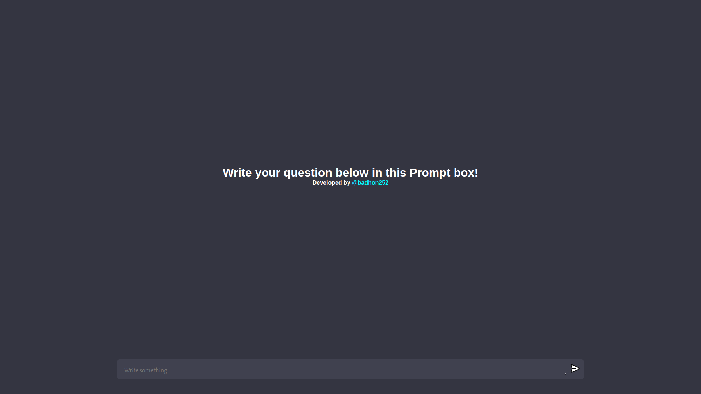
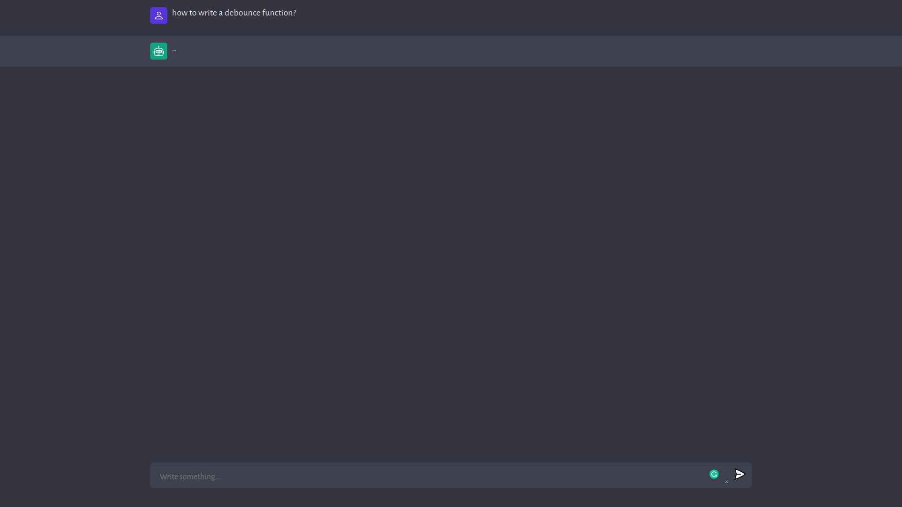
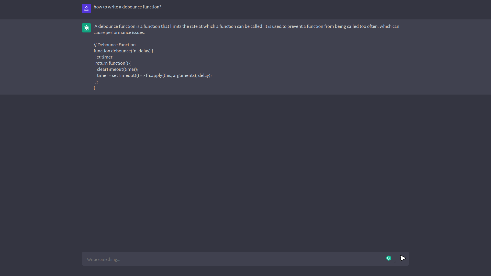

# chatGPT-v2
#Behind the reason to making of this.
## "Whenever there's a issue in the chatGPT's original website because of traffic, i don't wanted to be awaited, and that's why i make this cloned website to solve my problem quickly"

